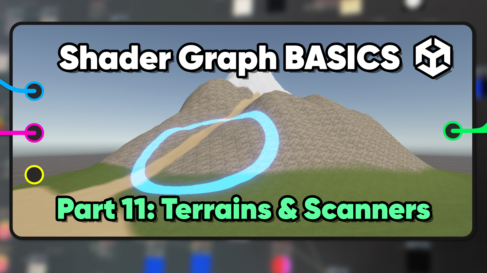

# Shader Graph Basics in Unity 6

A beginner crash course for Shader Graph in Unity 6.0 and above.

Parts 1-10 of this series can be found [here](https://github.com/daniel-ilett/shader-graph-basics-2022-3).

## Overview

Shader Graph is a powerful tool that lets you create beautiful materials for your games. This repository contains some basic shaders which are intended to show you the features and possibilities supported by Shader Graph.

## Tutorials

This project is part of a tutorial series which is available in the following places:

- [YouTube - Part 11](https://www.youtube.com/watch?v=q0tojB8a0MY)

## Authors

This project and the corresponding tutorials were created by Daniel Ilett.

## Release

The first part of this phase of the project was released on April 13th 2025.
